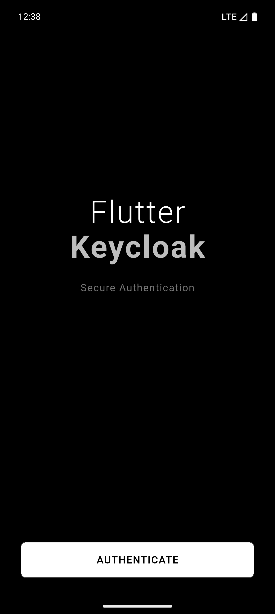
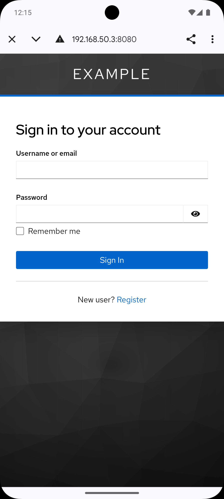
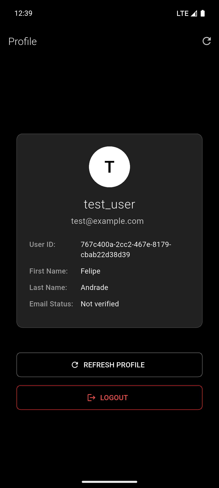

# Flutter Keycloak

A minimalist Flutter app demonstrating secure authentication with Keycloak using OAuth2/OpenID Connect.

## Features

- Clean, minimalist UI with dark theme
- Secure OAuth2/PKCE authentication
- JWT token management with auto-refresh
- Encrypted local token storage
- User profile display
- Proper logout with session termination

## Quick Start

1. **Start Keycloak**
   ```bash
   docker-compose up -d
   ```

2. **Run the App**
   ```bash
   flutter pub get
   flutter run
   ```

That's it! The app is pre-configured to work with Android Emulator out of the box.

## Keycloak Admin

Access the admin console at http://localhost:8080
- **Username**: admin
- **Password**: admin

The `mobile` client is automatically configured via `realm-export.json`.

## Technical Details

- **Realm**: `example`
- **Client ID**: `mobile`
- **Authentication**: OAuth2/OpenID Connect with PKCE
- **Token Storage**: Encrypted secure storage
- **Features**: Auto-refresh, proper logout, session management

## Screenshots

<p align="center">
  
  
  
</p>